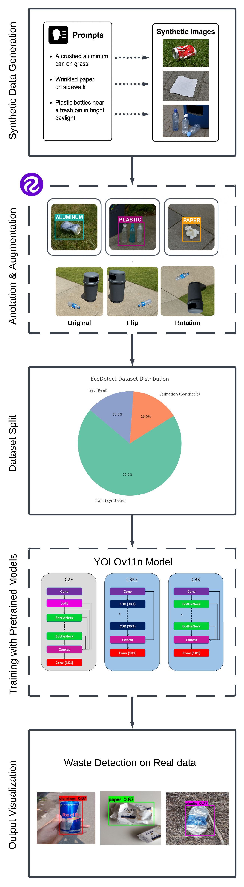
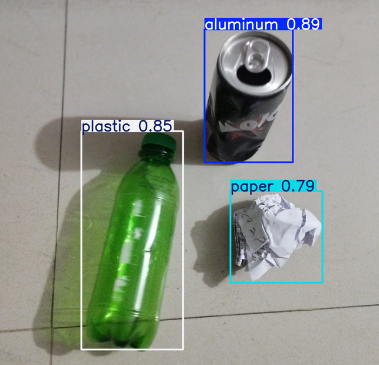

# EcoDetect: Real-Time Recyclable Waste Detection on Edge Devices

EcoDetect is a lightweight, scalable waste classification framework based on **YOLOv11n**, designed for **real-time deployment on edge devices** such as Raspberry Pi 5 and Jetson Nano. The model is trained entirely on **synthetic images** generated using LLM-guided prompt engineering, requiring no manual data collection.

---

## 🌐 Project Highlights

- ⚡ Real-time detection (<3 ms/image) on edge devices
- 🧠 YOLOv11n fine-tuned for 3 recyclable classes: plastic, paper, aluminum
- 🏭 Dataset generated using Stable Diffusion + Roboflow pipeline
- 🔬 Strong generalization: trained synthetic, tested real-world

---

## 🧰 Pipeline Overview



---

## 📦 Dataset

You can explore or download the full synthetic dataset (1,800+ annotated images) from **Kaggle**:

🔗 [EcoDetect Dataset on Kaggle](https://www.kaggle.com/datasets/ahsan71/ecodetect-recyclable-waste-detection-dataset)

---

## 🧪 Inference Demo



To test EcoDetect locally:

1. Clone the repository:
   ```bash
   git clone https://github.com/TheAhsanFarabi/EcoDetect.git
   cd EcoDetect
